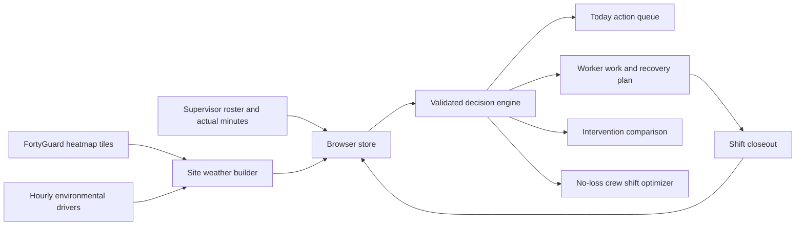

# Sunup

[](https://github.com/DataElk/sunup/actions/workflows/verify.yml)

**[Open the live application](https://dataelk.github.io/sunup/)**

Sunup turns site weather and actual minutes worked into a daily heat work plan for
each worker. It was built for the FortyGuard Hackathon 2026, with Model Designing as
the primary track and Industrial and Enterprise as the application track.

Sunup addresses a specific gap in calendar acclimatization schedules. Two workers can
be on the same employment day while having very different heat exposure histories.
Sunup estimates adaptation from environmental exposure, interpolates a personal limit
between the published NIOSH unacclimatized and acclimatized curves, and returns an
hourly work and rest plan.

This is a hackathon prototype. It is not validated for operational safety decisions.

## What is implemented

- Editable sites, crews, workers, shifts, trades, clothing, and actual-minutes logs.
- A start-of-shift plan with each worker's model prescription and calendar comparison.
- A supervisor action queue with prior-day change, closeout status, and the next
  pullable intervention.
- A worker-level intervention comparison for site, shift window, and additional
  hourly recovery.
- A crew shift optimizer that finds one shared start, preserves each worker's shift
  length, and refuses any plan that reduces a worker's prescribed heat-work time.
- A printable daily crew briefing with hourly work and recovery, shared field
  controls, individual exceptions, review boxes, and closeout state.
- Point and polygon site selection on an Arizona-constrained Leaflet map.
- Live FortyGuard `filter_type=3` calls for each site's daily cell minimum, mean, and
  maximum temperature.
- A 1 km request buffer, a 500 m edge discard, nearest safe-cell selection for points,
  and median interior-cell aggregation for boundaries.
- Hourly dry-bulb reconstruction fitted to the selected FortyGuard cell's minimum,
  mean, and maximum.
- Hourly humidity, wet bulb, shortwave radiation, cloud, and wind from Open-Meteo.
- The same black-globe and WBGT composition in Python and JavaScript, checked against
  a 24-hour cross-language regression fixture.
- Five concurrent initial live history tasks. Each completed day becomes usable
  immediately, followed by nine background backfill days.
- Six Open-Meteo forecast days for live sites. FortyGuard observations end on the
  last complete Arizona day.
- Browser persistence, cascading deletes, JSON export, and reset to the cached example.
- A cached two-site example that works when no FortyGuard key is configured.

## Run locally

Python 3.9 or newer and Node.js are required for the verification suite.

```bash
python -m pip install -r requirements.txt
python -m pytest
node scripts/check-design.mjs
python -m http.server 8777
```

Open `http://localhost:8777/app/index.html`.

The application uses JavaScript modules, so serve it over HTTP. Opening the file
directly with `file://` is not supported.

## Configure live weather

1. Open Settings.
2. Enter a FortyGuard API key and select Save key.
3. Use Test key to confirm authentication.
4. Create a site from Sites and crews or by clicking the site map.
5. Choose Set point or Draw boundary, finish the geometry, enter a name, and create it.

The key is stored only in that browser's local storage. It is not included in source
files, served assets, store exports, screenshots, or reset data. Do not add a key or a
`.env` file to Git.

Without a key, the cached example remains available and no FortyGuard request is made.
The site map still retrieves OpenStreetMap tiles when opened.

## Architecture



The Python implementation produces evidence, regression fixtures, and golden vectors.
The browser implementation uses generated constants and must reproduce those vectors
before deployment.

## Live data flow

For a new site, Sunup creates a buffered request around the selected point or boundary.
Each observed day follows this path:

1. Submit a FortyGuard `filter_type=3` heatmap request for the buffered area.
2. Poll the returned activity until it completes.
3. Remove cells close to the request boundary.
4. Select the nearest safe cell for a point, or the median of cells inside a boundary.
5. Fit Open-Meteo's hourly temperature shape to that FortyGuard cell's daily minimum,
   mean, and maximum.
6. Compose hourly WBGT with wet bulb, solar radiation, cloud, wind, and a modeled globe
   temperature.
7. Recompute every worker prescription attached to that site.

The first five observed days are submitted concurrently. Successful days are saved
independently and become usable as soon as they finish. The remaining nine continue
with bounded background concurrency. Paid activity IDs are persisted by date so an
interrupted or timed-out poll can resume without submitting the same FortyGuard task
again.

## FortyGuard request and response

The browser submits this shape to `POST https://api.fortyguard.com/v1/heatmap` with the
key in the `api-key` header:

```json
{
  "polygon_aoi": {
    "type": "FeatureCollection",
    "features": [
      {
        "type": "Feature",
        "properties": {},
        "geometry": {
          "type": "Polygon",
          "coordinates": [[
            [-112.08, 33.44],
            [-112.06, 33.44],
            [-112.06, 33.46],
            [-112.08, 33.46],
            [-112.08, 33.44]
          ]]
        }
      }
    ]
  },
  "date_time": {
    "start_date": "2026-08-27",
    "filter_type": 3
  },
  "granularity": 100
}
```

Submission returns an activity ID:

```json
{
  "data": {
    "activity_id": "example-activity-id"
  }
}
```

Sunup then polls `GET /v1/status/{activity_id}`. A completed response contains
`data.result.map_data.features`. Each selected feature provides the temporal daily
values used by the reconstruction:

```json
{
  "properties": {
    "min_temperature": 30.1,
    "average_temperature": 35.7,
    "max_temperature": 41.4
  }
}
```

See [FORTYGUARD_API_CONTRACT.md](FORTYGUARD_API_CONTRACT.md) for the tested schemas,
failure behavior, polling rules, and field traps.

## Model summary

1. Determine the worker's workload class from the assigned trade or explicit job
   override.
2. Compute daily heat stimulus from effective WBGT above the unacclimatized limit,
   weighted by actual minutes worked.
3. Advance a bounded adaptation state with separate gain and decay time constants.
4. Interpolate the worker's personal limit between the NIOSH RAL and REL curves.
5. Read the project's four-rung work and rest ladder at that personal limit.
6. Report the calendar schedule beside every prescription as the counterfactual.

Actual minutes are not decorative. Logging them changes the adaptation state and the
next day's prescription. Work beyond the prescription is also recorded as cumulative
overexposure.

The intervention comparison does not introduce another risk score. It runs the same
prescription engine with the same start-of-shift readiness while changing only the
selected site, shift window, or hourly work cap.

Age, sex, BMI, fitness, medical history, hydration, medication, ethnicity, residence,
and home address are forbidden inputs. The store and model reject them.

## Evidence and verification

```bash
python -m pytest
node scripts/check-design.mjs
python scripts/m3_report.py
python scripts/audit_ladder.py
python scripts/audit_resolution.py
python scripts/audit_constants.py
```

The test suite includes Python model tests, JavaScript golden-vector replay, source
contract tests, spatial boundary tests, CRUD interface guards, and a complete browser
environmental composition comparison against Python.

## Important limitations

- The work and rest ladder is this project's construction, not a NIOSH table.
- The OSHA heat rule discussed by the project is proposed, not law.
- The default WBGT path uses psychrometric wet bulb as the natural wet bulb. The tested
  direction of that approximation can under-read WBGT.
- The temperature endpoint emits 100 m tiles, but the measured Phoenix field is much
  smoother. The project reports an effective spatial scale closer to 2 km and does not
  claim street-feature resolution.
- The current hackathon key is limited to Arizona.
- Creating one fully backfilled site uses 14 asynchronous FortyGuard tasks and can take
  many minutes. Completed tasks consume credits.
- Future days beyond FortyGuard's current window use Open-Meteo forecasts.
- Data is stored in one browser. There is no shared account, backend, or team sync.
- The cached example is a replay dated 2026-08-08. Live sites use the current Arizona
  date, and the Today table displays each site's active weather date.

The full method, findings, self-corrections, and caveats are in
[WRITEUP.md](WRITEUP.md).

Submission-ready project descriptions, impact framing, technical claims, limitations,
and likely-question responses are collected in [SUBMISSION.md](SUBMISSION.md).

## Repository layout

```text
src/sunup/       Python model, physics, data sources, and site selection
app/             Static browser application and live environmental pipeline
scripts/         Data builders, reports, and audits
fixtures/        Raw and derived regression evidence
tests/           Python, JavaScript, contract, and interface verification
.github/         Continuous verification on every push to main
SPEC.md          Model and data specification
WRITEUP.md       Submission narrative and findings
SUBMISSION.md    Written submission copy and likely-question responses
DESIGN_SYSTEM.md Interface rules and rationale
```

OpenStreetMap data is used under ODbL with attribution shown on each live map.
